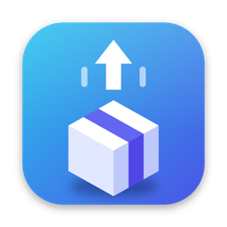
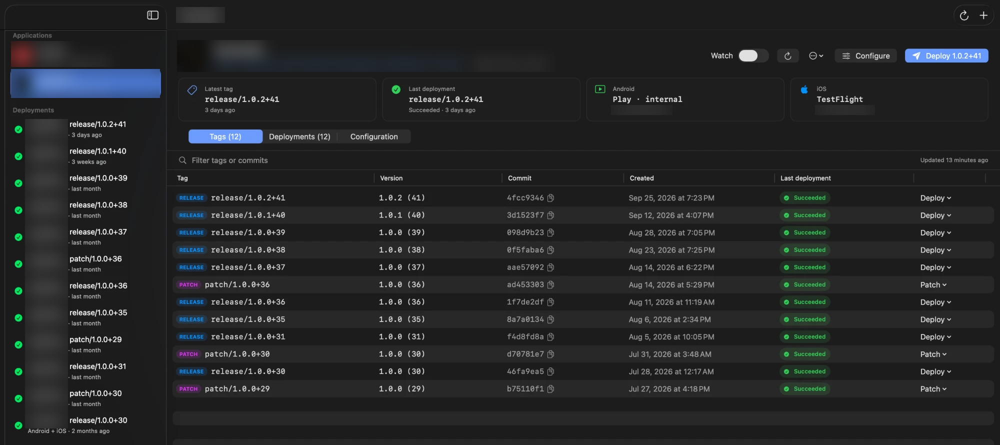

<div align="center">



# Mili Ship

**Push a tag. Your app ships.**<br>
CI/CD for Flutter and React Native that runs on your own Mac — builds, signs and publishes to Google Play and TestFlight, no build server needed.

[](https://github.com/MiliIdea/MiliShip/releases/latest)


<br>



<sub>An app's page — every tag, its version and its last deployment</sub>

</div>

<br>

## Why Mili Ship

Hosted CI for mobile apps is slow, expensive in macOS minutes, and a pain to
keep signed. Your Mac already has Xcode, the Android SDK, your keys and your
certificates. Mili Ship turns it into the release machine:

```
git tag release/1.4.0+52 && git push --tags
        │
        ▼
  Mili Ship  ── checkout → install → build → sign ──┬──▶  Google Play  (internal / beta / production)
  (your Mac)                                         └──▶  App Store Connect  →  TestFlight
```

No fastlane, no YAML, no paid minutes. Mili Ship talks to the Google Play
Developer API and App Store Connect directly.

## What's inside

<table>
<tr>
<td width="50%" valign="top">

### Flutter and React Native
Flutter builds with `flutter` or **Shorebird** — including over-the-air
patches from `patch/…` tags. React Native builds with Gradle and
`xcodebuild`, bare or **Expo**. npm, yarn, pnpm, bun, melos and FVM all work.

</td>
<td width="50%" valign="top">

### A wizard that reads your repo
Point it at a Git URL. Mili Ship clones it, finds the app — even deep in a
monorepo — and fills in the package name, bundle ID, team ID, flavors,
entry points and your app's own icon.

</td>
</tr>
<tr>
<td valign="top">

### Signing handled
Google Play App Signing with an upload key (Mili Ship can generate one), or
your own key. Automatic iOS signing with an App Store Connect API key, or
your own ExportOptions.plist. Passwords live in the macOS Keychain.

</td>
<td valign="top">

### Versions your way
Require the tag to match `pubspec.yaml` / `build.gradle`, take the version
from the tag, or let Mili Ship auto-increment the build number from what's
already on the stores.

</td>
</tr>
<tr>
<td valign="top">

### Tag-driven, hands-off
Watch GitHub from the menu bar and deploy new tags automatically, or pick
any tag and press **Deploy**. Builds run in a queue, one platform failing
never stops the other.

</td>
<td valign="top">

### Everything visible
Live logs with secrets masked, step-by-step progress, a full deployment
history and notifications when a release lands. Everything stays on your Mac.

</td>
</tr>
</table>

## Get started

1. **[Download the latest DMG](https://github.com/MiliIdea/MiliShip/releases/latest)**, open it and drag Mili Ship onto **Applications** — or [build it from source](#build-from-source).
2. Open Mili Ship and press **⌘N**. Paste your repository URL; the wizard detects your app and walks you through Google Play and App Store Connect.
3. Push a tag:

   ```bash
   git tag release/1.0.0+1 && git push origin release/1.0.0+1
   ```

That's it — watch it build on the app's page.

### Build from source

You need macOS 13 or newer and **Xcode 16 or newer**.

```bash
git clone https://github.com/MiliIdea/MiliShip.git
cd MiliShip
open MiliShip.xcodeproj           # then ⌘R to run
# or from the command line:
./scripts/build_app.sh            # → build/MiliShip.app
```

## What your Mac needs

Mili Ship drives the tools that are already installed on the Mac. It doesn't bundle them.

| For | Install |
|---|---|
| Everything | Xcode with command line tools, git (with access to your repos via SSH key or credential helper) |
| Flutter builds | [Flutter](https://docs.flutter.dev/get-started/install/macos), or [FVM](https://fvm.app) |
| Shorebird builds | [Shorebird CLI](https://docs.shorebird.dev) (`shorebird login:ci` gives you a token) |
| React Native builds | [Node.js](https://nodejs.org) (Homebrew, nvm or Volta) and the package manager your repo uses (npm, yarn, pnpm or bun) |
| Monorepos | [melos](https://melos.invertase.dev) if your repo uses it |
| Android | Android SDK and a JDK (Android Studio installs both) |
| iOS | CocoaPods if your project uses it |

Apps opened from Finder don't inherit your terminal's `PATH`. If a tool isn't found, open **Mili Ship → Settings**.
Click **Import PATH from my zsh**, then **Check tools**.

## Adding an application

Click **Add Application** (⌘N). The wizard has seven steps:

| Step | What you set up |
|---|---|
| **1 · Repository** | Name, Git URL and the clone folder (default `~/MiliShip/<name>-<id>`). Mili Ship keeps its own clone, so your working copy is never touched. |
| **2 · Project** | Pick the app that was detected in the repo; the framework is filled in. **Flutter:** the Flutter command (`flutter` / `fvm flutter`), the install command (`flutter pub get` / `melos bootstrap`), and optionally a flavor, `--target`, `--dart-define-from-file` and extra build arguments. **React Native:** the install command (`npm ci`, `yarn`, `pnpm`…), Expo prebuild, CocoaPods, the Gradle task / flavor, and the iOS workspace, scheme and configuration. |
| **3 · Prepare** | Git-ignored files to copy in (`google-services.json`, `GoogleService-Info.plist`, `.env`, config files). Commands to run before the build (`dart run build_runner build -d`, …). |
| **4 · Build & versioning** | Flutter or Shorebird (token, allow native/asset diffs, Flutter version); React Native always builds with Gradle + xcodebuild. Tag prefixes, the version strategy, and whether to watch and auto-deploy. |
| **5 · Google Play** | ① Signing: upload keystore, alias and passwords. ② API access: package name and service account JSON. ③ Release: track, rollout, release notes. ④ Test connection. |
| **6 · App Store** | ① API key: Key ID, Issuer ID, .p8. ② Bundle ID and team ID. ③ Signing: automatic, or your own ExportOptions.plist. ④ Upload. ⑤ Test connection. |
| **7 · Review** | A summary, plus a list of anything still missing. You can save now and finish later. |

Then push a tag:

```bash
git tag release/1.0.0+1 && git push origin release/1.0.0+1
```

Watch it on the app's page, or deploy any tag manually with the **Deploy** menu.

### Keyboard shortcuts

| Shortcut | Action |
|---|---|
| ⌘N | Add application |
| ⌘D | Deploy the latest release tag of the selected app |
| ⌘E | Configure the selected app |
| ⌘R / ⇧⌘R | Check GitHub for the selected app / all apps |
| ⌘. | Cancel the running deployment |
| ⌘, | Settings (PATH, toolchain check, open at login) |

## Tags and versions

| Tag | Flutter | Shorebird | React Native |
|---|---|---|---|
| `release/1.2.0+45` | `flutter build appbundle` / `ipa` → stores | `shorebird release android/ios` → stores | `./gradlew bundleRelease` / `xcodebuild archive` → stores |
| `patch/1.2.0+45` | — | `shorebird patch --release-version=1.2.0+45` (over the air, no store upload) | — |

Prefixes can be set per app, for example `v1.2.0+45`. Existing tags are remembered the first time Mili Ship syncs
an app, and they are never deployed retroactively.

| Version strategy | Result |
|---|---|
| **Tag must match pubspec.yaml** (default) | Fails unless the tag equals `version:` in `pubspec.yaml`. Version bumps stay reviewable in git. |
| **Take the version from the tag** | Builds with `--build-name=1.2.0 --build-number=45`. |
| **Auto-increment the build number** | Name from the tag or pubspec. Number = highest build on Google Play / App Store Connect + 1. |
| **Use pubspec.yaml as-is** | The tag is only the trigger. |

For React Native, "the project version" is `versionName` / `versionCode` in `android/app/build.gradle`
(or `MARKETING_VERSION` / `CURRENT_PROJECT_VERSION` in the Xcode project when there's no Android app). When the version
comes from the tag or the stores, Mili Ship sets it in `build.gradle` for the build and passes it to `xcodebuild` as build settings.

## Store setup

### Google Play

1. In **Google Cloud Console**, enable the *Google Play Android Developer API*. Then create a **service account** and download a **JSON key**.
2. In **Play Console**, go to *Users and permissions*. Invite the service account's e-mail and grant release permissions for your app.
3. Upload the **first** build of a brand-new app manually in Play Console. The API can only update apps that exist.
4. If the app has never been published, use the **Draft** release status.

For signing, choose **Google Play App Signing** (you sign uploads with an upload key; Mili Ship can generate one) or
**your own app signing key**. For Flutter, Mili Ship writes the standard `android/key.properties` before the build and removes it afterwards
([Flutter docs](https://docs.flutter.dev/deployment/android#configure-signing-in-gradle)), so your
`android/app/build.gradle(.kts)` needs to read that file. For React Native, the keystore is passed to Gradle as
`android.injected.signing.*` properties, so nothing needs to change in the project. Choose **Handled by the project's Gradle config**
if your build signs itself.

### App Store Connect

1. Go to *Users and Access → Integrations → App Store Connect API → Team Keys*. Generate a key with the **App Manager** or **Admin** role.
   Download the `.p8` file, and note the Key ID and Issuer ID.
2. Create the app record in App Store Connect (*My Apps → +*).
3. **Automatic signing** lets Xcode create and download certificates and profiles with the API key. Signing in to
   *Xcode → Settings → Accounts* also works. If you already manage profiles yourself, choose **ExportOptions.plist from the repository**.

Uploads use `xcodebuild -exportArchive` with `destination: upload`. Builds appear in TestFlight once Apple finishes processing.

## What a deployment does

1. Validates the configuration.
2. Checks out the tag in the app's own clone. It forces the checkout, resets, cleans and updates submodules.
3. Resolves the version.
4. Checks the tools: git, Flutter/FVM, Shorebird, node, the package manager, CocoaPods, xcodebuild.
5. Copies local files, installs dependencies, runs `expo prebuild` if enabled, then the pre-build commands.
6. **Android:** sets up signing, builds the `.aab`, then publishes to Google Play. Publishing creates an edit, uploads the bundle, assigns the track and commits.
7. **iOS:** prepares export options, runs CocoaPods (React Native), builds the archive, then uploads it to App Store Connect.

If one platform fails, the other one still runs. Logs are stored in `~/Library/Application Support/MiliShip/logs`.

## Privacy & security

- Everything runs locally. Mili Ship only talks to your git host, Google Play and App Store Connect.
- Passwords and tokens are stored in the macOS **Keychain**, per application. Key files stay where you keep them;
  Mili Ship stores only their paths.
- Logs mask stored secrets.
- Mili Ship isn't sandboxed. It needs to run your build tools, just like a terminal does.

## Contributing

See [CONTRIBUTING.md](CONTRIBUTING.md). Issues and pull requests are welcome.

## License

[MIT](LICENSE)
